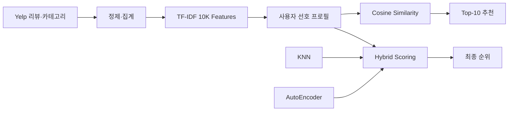
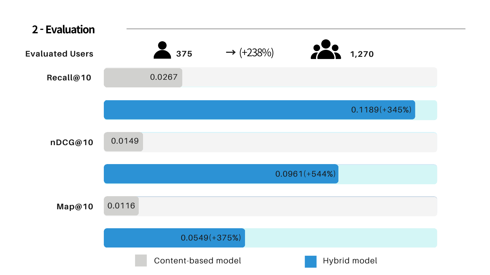

# Restaurant Recommendation System

  

> Yelp 리뷰로 사용자 취향을 표현하고 OpenTable 데이터에서 전이 성능을 확인한 머신러닝 팀 프로젝트입니다.

## 프로젝트 설명

리뷰·카테고리처럼 설명 가능한 콘텐츠 정보와 사용자 행동 신호를 결합해 레스토랑을 추천했습니다. 개인 담당 모델인 TF-IDF 콘텐츠 추천을 기준선으로 구축하고, 팀의 KNN·AutoEncoder 결과와 결합해 데이터 희소성과 cross-domain 문제를 개선하는 과정을 실험했습니다.

## 주요 기능과 모델

- Yelp 비즈니스·리뷰 데이터 전처리
- 레스토랑별 리뷰와 카테고리의 TF-IDF 벡터화
- 긍정 평가 항목을 평균한 사용자 취향 프로필 생성
- 코사인 유사도 기반 Top-10 추천
- OpenTable 데이터로 zero-shot 전이 평가
- TF-IDF·KNN·AutoEncoder 점수를 결합한 하이브리드 추천
- Recall@10, nDCG@10, MAP@10 기반 비교

## 추천 파이프라인

## 개인 담당: TF-IDF 추천

- `business_id`별 리뷰·이름·카테고리를 하나의 문서로 구성
- `max_features=10,000`, unigram·bigram, `float32` 기반 희소 행렬 생성
- 선호 평점 이상의 레스토랑 벡터를 평균해 사용자 프로필 구축
- 사용자 프로필과 아이템 행렬의 내적으로 추천 점수 계산
- 마지막 리뷰 1건을 기준으로 오프라인 Top-K 평가
- Yelp에서 학습한 벡터를 OpenTable에 적용해 카테고리 적합도 확인

## 개발 과정과 문제 해결

1. 약 15만 개 레스토랑과 대규모 리뷰를 정제해 아이템 문서를 구성했습니다.
2. 30,000개 feature 설정에서 메모리 부족이 발생해 10,000개로 축소했습니다.
3. `numpy.matrix` 호환 오류를 `ndarray` 변환과 reshape로 해결했습니다.
4. dense 변환을 줄이고 CSR 희소 연산, 사용자 샘플링, 후보 제한을 적용했습니다.
5. TF-IDF 기준선을 평가한 뒤 팀의 KNN·AutoEncoder와 가중 결합했습니다.

## 주요 결과

| Model | Evaluated users | Recall@10 | nDCG@10 | MAP@10 |
|---|---:|---:|---:|---:|
| TF-IDF baseline | 375 | 0.0267 | 0.0149 | 0.0116 |
| Hybrid | 1,270 | 0.1189 | 0.0961 | 0.0549 |

  

TF-IDF는 OpenTable 카테고리 적합도 기준 `Category-Hit@10 ≈ 0.41`을 기록했습니다. 단독 모델의 순위 지표는 낮았지만, 텍스트 기반 선호 신호가 다른 도메인에도 일부 일반화됨을 확인했고 하이브리드 모델의 입력으로 활용했습니다.

## 저장소와 기여 범위

이 저장소는 팀 저장소를 fork한 개인 포트폴리오용 저장소입니다. 원본 팀 저장소는 `ML-team12/ML-recommendation`이며, 본 README는 개인 담당인 TF-IDF 모델과 팀 전체 결과를 구분해 설명합니다.

## 프로젝트 범위 및 유의사항

- 머신러닝 과목의 팀 프로젝트이며 전체 코드와 결과는 팀 공동 작업입니다.
- 공개 저장소이지만 별도의 오픈소스 라이선스가 없다면 코드 재사용·재배포가 자동으로 허용되는 것은 아닙니다.
- Yelp·OpenTable 원본 데이터와 26GB 이상의 전처리·모델 산출물은 용량 및 사용 조건 때문에 포함하지 않았습니다.
- 발표 자료의 이름·학번 등 개인 정보는 저장소에서 제외했습니다.
- 지표는 제한된 평가 사용자와 특정 분할에서 얻은 수업용 실험 결과로 실제 서비스 품질을 보장하지 않습니다.
- 추천 결과는 편향되거나 부정확할 수 있으며 상업적 추천 시스템으로 검증된 모델이 아닙니다.
